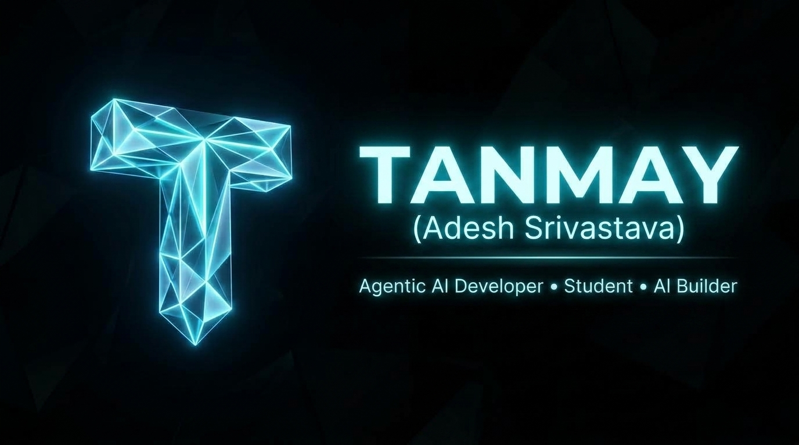
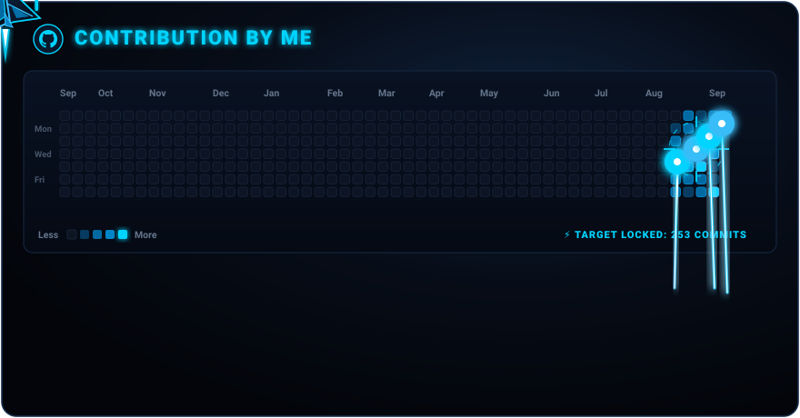

<!-- BANNER -->

  

<!-- TYPING ANIMATION — ALL CAPS -->

  

---

## ⚡ ABOUT ME

<table>
<tr>
<td width="50%">

### 🧠 The Brain Behind The Code

I'm **Tanmay** — a builder, educator, and relentless creator.

While others chase certificates, I chase **real-world impact**.  
I build free learning resources — **code + notes + questions** — for students learning Python, JS, HTML, CSS, C & C++.

My bet? **Make programming feel less scary, more exciting.**

</td>
<td width="50%">

### 🚀 Right Now I'm...

| | |
|---|---|
| 🔨 | Building AI projects from zero |
| 🤝 | Collab-ing with AI beginners |
| 📚 | Teaching 6 languages at once |
| 🎯 | Targeting mastery, not mediocrity |
| 💥 | Creating something different |

</td>
</tr>
</table>

  
  &nbsp;
  
  &nbsp;
  

---

## 🛠️ TECH ARSENAL

### 💻 Languages

  

### 🧰 Tools & Platforms

  

### 🤖 AI / ML Stack

  

  
  &nbsp;
  
  &nbsp;
  
  &nbsp;
  

---

## 🎯 AI ROADMAP — BASIC TO MASTERY

-00D4FF?style=for-the-badge&logo=scikitlearn&logoColor=white)

  

---

## 📚 STUDENT RESOURCES I'M BUILDING

| Language | What You Get | Repo |
|----------|-------------|------|
| 🐍 Python | Code + Notes + Practice Questions | [PYTHON-A-TO-Z](https://github.com/tanmay119-pera/PYTHON-A-TO-Z) |
| 📄 HTML | 5 Chapters + Notes + 2 Projects | [HTML-Learning-beginners-](https://github.com/tanmay119-pera/HTML-Learning-beginners-) |
| 🌐 JavaScript | Code + Notes + Practice Questions | 🔜 Coming Soon |
| 🎨 CSS | Code + Notes + Practice Questions | 🔜 Coming Soon |
| ⚙️ C | Code + Notes + Practice Questions | 🔜 Coming Soon |
| 🔧 C++ | Code + Notes + Practice Questions | 🔜 Coming Soon |

> ⭐ **Star the repos if they help you — it keeps me going!**

---

## 🏆 CONTRIBUTION GRAPH

  
  &nbsp;
  

  

  

---

## 🤝 LET'S CONNECT

  
  &nbsp;&nbsp;
  
  &nbsp;&nbsp;
  
  &nbsp;&nbsp;
  
  &nbsp;&nbsp;
  

---

  

